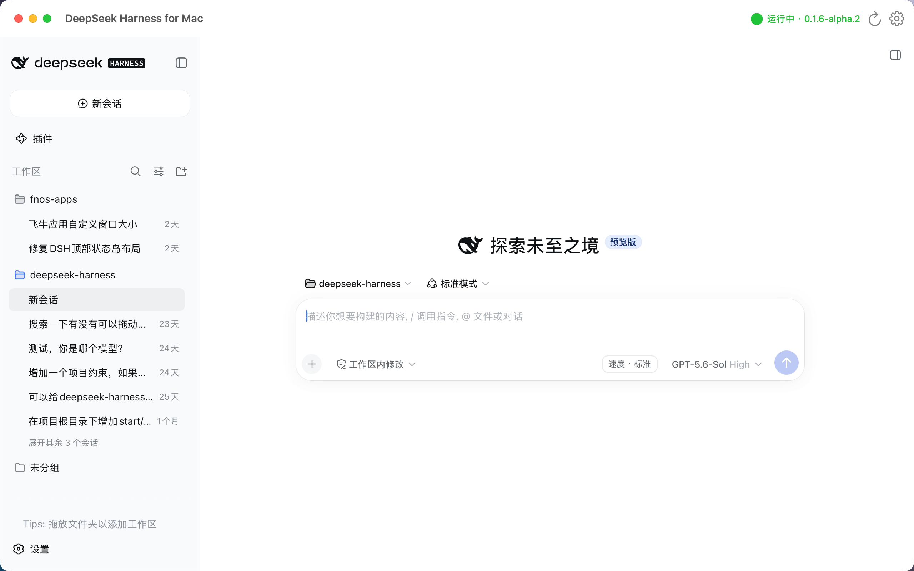
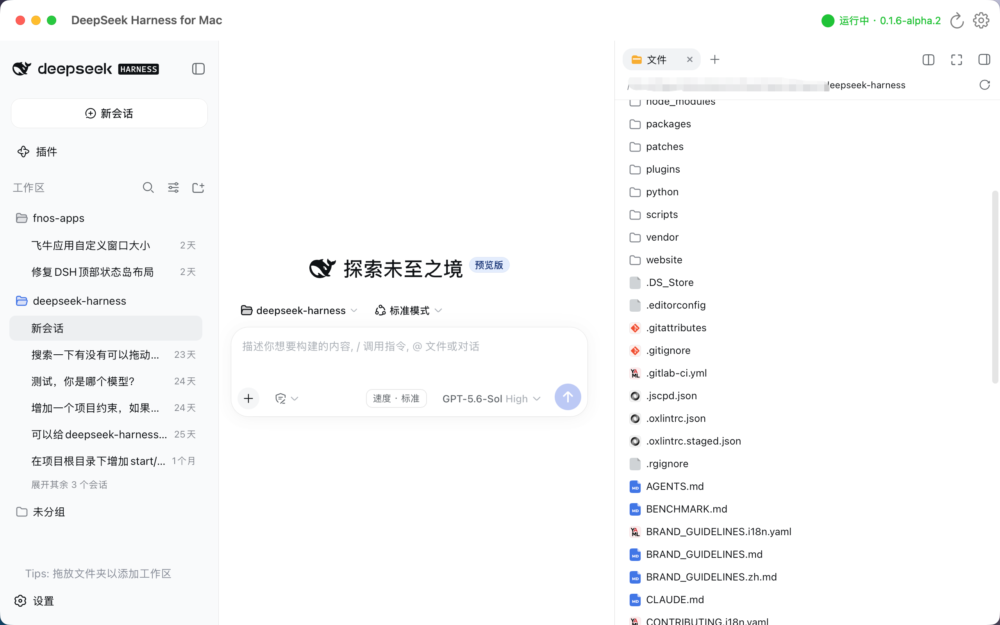
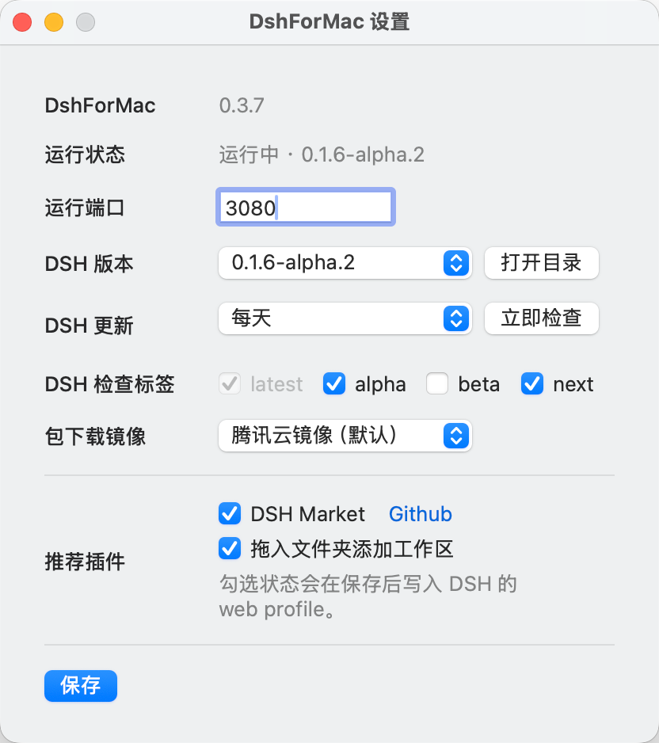

# DshForMac

**DshForMac（DeepSeek Harness for Mac）** 是 [DeepSeek Harness（DSH）](https://github.com/deepseek-ai/deepseek-harness) 的原生 macOS 启动器与本地容器。它负责检测本机 Node.js、下载和管理经过校验的 DSH 版本、启动本地 DSH Web 服务，并在应用窗口中显示 DSH 界面。

它不是 DSH 的分叉实现，不会重定向 DSH 的用户数据，也不会修改全局 npm、pnpm、Node.js 或 shell 配置。

> 项目初衷：网上其实有很多`Mac桌面端`了，但是基本都要求最新的系统或者支持到14/15系统就算好的了，但我觉得应该还是有部分用户仍在使用旧系统（包括我还有台13系统的）。所以，只要你电脑能装dsh必须的`22.19`或`24`以上版本的nodejs，那么你就可以安装这个应用。

## 功能

- 自动检测 Node.js、npm、npx，以及可选的 pnpm/Corepack；支持手动选择 `node` 可执行文件。
- Node.js 可用后自动启动 DSH；首次运行会下载 `@deepseek-ai/dsh` 的精确版本并校验完整性。
- 为每个 DSH 版本建立独立运行时目录；启动健康检查通过后才切换当前版本，默认保留最新五个受管版本，并额外保护当前运行或用户固定的版本。
- 使用内嵌 WebView 打开本机 DSH 服务，默认地址为 `http://127.0.0.1:3080`；端口可在设置中修改。
- 提供 DSH 版本选择、更新检查频率、可多选的 DSH 检查标签（latest 固定勾选）、包下载镜像、端口设置、一键重启与菜单栏控制。
- DshForMac 应用每天检查一次 GitHub 发布版本；发现新版后可稍后提醒、忽略此版本，或直接安装并重启。设置和菜单栏均可手动检查应用更新，失败时可打开 GitHub 发布页面手动安装。
- 设置中可一键启用或禁用推荐插件：已安装的 DSH Market 会自动识别；启用“拖入文件夹添加工作区”后，Finder 文件夹拖到左侧栏会创建 DSH 工作区，右侧仍按 DSH 原逻辑添加对话附件。
- ~~可在应用右侧只读预览 DSH 产出的文本、Markdown、图片和 SVG 文件。~~ `DSH 0.1.5-alpha.1` 开始已经内置右侧预览窗口，此功能不再迭代，只留作兼容旧聊天内的链接。等DSH正式版发布后将移除相关代码。

## 界面预览

点击缩略图可查看原图。

<table>
  <tr>
    <td align="center" width="50%">
      <a href="screenshots/main.png"></a><br>
      <strong>主界面</strong>
    </td>
    <td align="center" width="50%">
      <a href="screenshots/folder-tree.png"></a><br>
      <strong>文件树</strong>
    </td>
  </tr>
  <tr>
    <td align="center">
      <a href="screenshots/terminal.png"></a><br>
      <strong>终端</strong>
    </td>
    <td align="center">
      <a href="screenshots/dragdrop-to-add-workspace.png"></a><br>
      <strong>拖入文件夹添加工作区</strong>
    </td>
  </tr>
  <tr>
    <td align="center" colspan="2">
      <a href="screenshots/setting.png"></a><br>
      <strong>应用设置</strong>
    </td>
  </tr>
</table>

## 系统要求

- macOS 11 或更高版本。
- 可用的 Node.js：v22.19 或更高的 v22，或 v24 及更高版本。
- 与 Node.js 配套的 `npm` 和 `npx`。
- 能访问所选 npm registry。默认使用腾讯云镜像：`https://mirrors.cloud.tencent.com/npm/`。

应用不包含 Node.js。若未检测到兼容版本，DshForMac 会给出说明并可打开 Node.js 官网；安装完成后回到应用重新检测即可。

## 安装与首次启动

1. 打开发布的 `DshForMac-<版本>-unsigned.dmg`。
2. 将 `DshForMac.app` 拖入“应用程序”（`/Applications`）文件夹。
3. 打开 DshForMac。检测到兼容的 Node.js 后，应用会自动下载、校验并启动 DSH；首次启动需要保持网络可用。

当前应用未签名。若 macOS 的 Gatekeeper 阻止打开，请先在“系统设置 → 隐私与安全性”中选择“仍要打开”，或在终端执行下面的命令移除应用的隔离属性：

```sh
sudo xattr -rd com.apple.quarantine /Applications/DshForMac.app
```

执行后再次打开应用。该命令仅应针对你信任来源获得的 DshForMac 应用使用。

## 使用说明

首次成功启动后，DSH 会显示在主窗口中。常用操作如下：

- 菜单栏可显示主窗口、查看 DSH 状态、重新加载页面、重启 DSH、检查 DSH 更新或打开设置；关闭主窗口后，DSH 服务继续运行。
- 在设置中的 DshForMac 版本号旁，或菜单栏中选择“检查 DshForMac 更新”。应用自动检查每天至多一次，安装前由用户确认；若自动安装失败，可从设置打开 [GitHub 发布页面](https://github.com/hpyer/dsh-for-mac/releases)手动下载。请先将应用从 DMG 拖入“应用程序”，不要直接从 DMG 运行。
- 通过“设置…”修改服务端口、下载镜像、DSH 版本和 DSH 更新检查频率；`latest` 始终检查，勾选启用后可额外选择 alpha、beta 或 next 标签。可打开已安装版本目录或点击“检查 DSH 更新”。每天、每周和每月检查在应用持续运行时也会到期触发；发现 DSH 新版本后工具栏立即提示，在设置的状态说明旁点击“下载”才会下载更新。
- 在“设置 → 推荐插件”中启用或禁用 DSH Market 与“拖入文件夹添加工作区”；变更会写入 DSH 的 web profile 并自动重启 DSH。
- 当端口已被其他非 DshForMac 管理的服务占用时，请停止该服务或在设置中更换端口。
- 点击 DSH 中的产出物文件，会在右侧以只读方式预览受支持的内容；不受支持的文件可确认后使用默认应用打开。

DSH 的配置、会话和插件仍由 DSH 使用其上游默认用户数据路径管理。DshForMac 只在 `~/Library/Application Support/DshForMac/runtimes/` 下保存受管 DSH 版本。

## 从源码构建

项目使用 Swift Package Manager：

```sh
swift test
swift run DshForMac
```

如需生成通用 macOS DMG，请运行：

```sh
./scripts/package-dmg.sh
```

输出文件位于 `dist/`，且为未签名产物。打包脚本不会覆盖同名 DMG；重新构建同一版本前，需要先处理已有产物或更新版本号。源码直接运行时没有可替换的 `.app`，应用更新只在打包后的应用中启用。

## 自动发布

推送形如 `v0.1.0` 的语义化 Git 标签会触发 GitHub Actions。工作流在 Intel 和 Apple Silicon Runner 分别构建与测试，在 macOS Runner 合成一个通用 DMG，并生成带 EdDSA 签名的 `appcast.xml`；两者共同发布到 GitHub Release。应用通过固定的 `releases/latest/download/appcast.xml` 地址检查稳定版，不调用 GitHub Releases API。预发布标签生成的 Release 不会成为默认稳定版更新源。

发布前需将与 `Packaging/Info.plist` 中 `SUPublicEDKey` 对应的 Sparkle 私钥，保存为仓库 Actions 密钥 `SPARKLE_PRIVATE_KEY`；缺失时工作流会停止发布。当前公钥对应的私钥保存在本机钥匙串账号 `cn.hpyer.dshformac` 中。已安装并登录 GitHub CLI 时，可执行：

```sh
key_dir="$(mktemp -d)"
.build/artifacts/sparkle/Sparkle/bin/generate_keys --account cn.hpyer.dshformac -x "$key_dir/private-key"
gh secret set SPARKLE_PRIVATE_KEY < "$key_dir/private-key"
rm -f "$key_dir/private-key"
rmdir "$key_dir"
```

也可通过 GitHub 仓库设置添加密钥。不要将私钥提交到仓库；请另行安全备份钥匙串中的密钥。Sparkle 的更新包签名与 Apple Developer ID 签名不同；发布的应用仍未经过 Apple 签名或公证。

发布前请同步更新 `Packaging/Info.plist` 的 `CFBundleShortVersionString`、`AppMetadata.version` 和 `CHANGELOG.md` 中的版本号，并递增 `CFBundleVersion`；工作流会校验前两者必须与标签一致。已安装的旧版本不含应用更新器，需要手动安装一次加入此功能的新版本。新版本的应用包标识为 `cn.hpyer.dshformac`；首次启动时会迁移旧标识下的偏好设置。

更多实现细节见 [架构文档](docs/architecture.md)。

## 本地 DSH 插件

项目自研的 DSH 插件位于 [`dsh-plugins/`](dsh-plugins/)，该目录本身是 pnpm
workspace 根目录。它们与原生壳分开开发和验证，尚未发布为正式 npm 包。

# License

This project is licensed under the [MIT License](LICENSE).
